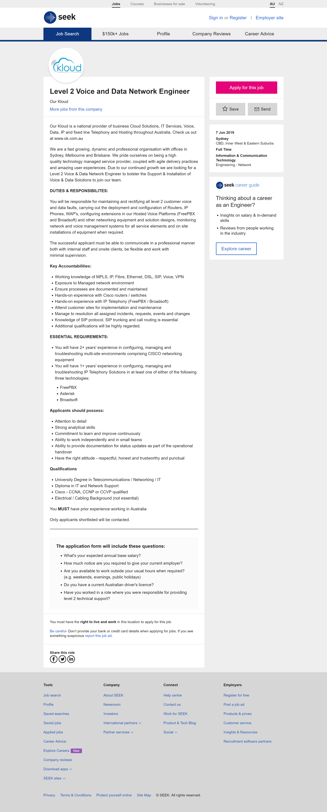

<!DOCTYPE html>
<html>

    <head>
        <title>Assignment 1</title>
    </head>

    <body>
        

            <h1>Personal Information</h1>
            <ul>
                <li>Name: Patrick Mugasa</li>
                <li>Student number: s3792796</li>
                <li>Email address: s3792796@student.rmit.edu.au</li>
                <li>Education to date: Higher school certificate</li>
                <li>Hobbies: Playing FIFA, currently learning how to play the guitar</li>
            </ul>
        

        

            <h1>Interest in IT</h1>
            

                My interest in IT is in networking. My interest started out in programming but eventually 
                turned into networking. This is mainly because I was introduced to programming before 
                I knew about networking. This was all introduced to me by my brother in law who taught
                me how to program in C.
            

            

                I chose to come to RMIT because it is a well-known university with a good reputation 
                but also allows me to study online. By studying online, I can keep my job and study at 
                the same time. It also introduces me to different communication technologies that can 
                be useful in real life.
            

            

                I expect to learn everything needed in the IT workforce. I also expect to develop my 
                ability to do research about any topic on the internet and improve my communication 
                skills by using appropriate technologies. 
            

        

        

            <h1>Ideal Job</h1>
            

                Link: <a href="https://www.seek.com.au/job/39209284?type=promoted&searchrequesttoken=cb839767-1f8c-442c-9162-12f76bd3ffa7">Seek</a>
            

            
Snapshot:

            

                
            

            
<cite>SEEK. (2019). [online] Available at: https://www.seek.com.au/job/39209284?type=promoted&searchrequesttoken=cb839767-1f8c-442c-9162-12f76bd3ffa7 [Accessed 16 Jun. 2019].</cite>

            

                The job position is to maintain a level 2 network and installation of networks where 
                required. This is an ideal job for me as I'm interested in networking.
            

            

                The job requires a working knowledge of MPLS, IP, Ethernet and VPN and experience 
                working with Cisco routers and switches. It also requires 2+ years working with Cisco 
                equipment, a university degree in telecommunications and be a Cisco CCNA or CCNP.
            

            

                I don't have any of the skills and experience required for the job, however, I'm currently 
                working towards my degree in IT and looking towards getting a CCIE in routing and 
                switching and a CCIE in security which will give me the skills needed for the job.
            

        

        

            <h1>Personal profile</h1>
            <h3>Myers-Briggs Type Indicator (MBTI) test results</h3>
            <ul>
                <li>Type: Assertive architect</li>
                <li>Code: INTJ-A</li>
                <li>Role: Analyst</li>
                <li>Strategy: Confident individualism</li>
            </ul>
            <h3>Learning style test results</h3>
            <ul><li>Visual learner</li></ul>
            <h3>Big five personality test results</h3>
            <ul>
                <li>Openness: 71%</li>
                <li>Conscientiousness: 58%</li>
                <li>Extraversion: 8%</li>
                <li>Agreeableness: 69%</li>
                <li>Neuroticism: 46%</li>
            </ul>
            

                According to these results, I'm a visually introverted agreeable learner. I'm also an open 
                Conscientious person.
            

            

                Being Conscientious will help my groupmates as I'll be willing to do my part of the 
                project however, I'll have to be less introverted and try to communicate more with the team.
            

            

                According to these results, I should be looking for less introverted people in groups as 
                they can easily startup conversations and setup means of communication for the group. 
                I should also be looking for Conscientious people who are willing to do their work.
            

        

        

            <h1>Project Idea</h1>
            

                The project involves making a trading robot that makes automatic trades in a chosen 
                market on behalf of the trader. The market can be any market e.g. the forex market, 
                the futures market, etc. After deciding the market, the next step is to choose a broker 
                that allows a simulation account. A simulation account allows to make mistakes without 
                losing real money in the market which can save you a lot of money while developing and 
                improving the robot. After choosing the broker, the robot can be programmed using the 
                broker's API and the programming language in which the API is written.
            

            

                If successful, a trading robot can make you a lot of money with minimal input, however, 
                if the robot messes up, you can lose a lot of money which is why you should be careful 
                and consider all case scenarios while programming the robot. Developing the robot is a 
                good learning experience as it teaches you to learn an unknown API and a programming 
                language you might not know. This can develop your self-study skills which you can apply 
                in other scenarios. The development process also introduces you to the financial markets 
                which is something you might end up enjoying.
            

            

                For the project, I've chosen the forex market as it is the biggest market in the world and 
                pepperstone as my broker. Pepperstone has a well-documented API that is written in C#. The 
                robot will use the simple moving average strategy. It will buy when the price moves up and 
                crosses the 10-day period simple moving average and will sell when the price moves down and 
                crosses the 10-day period moving average. It will also use the exponential moving average 
                strategy where it will buy when the price moves up and crosses the 10-day exponential moving 
                average and sell when the price moves down and crosses the 10-day exponential moving average. 
                The robot should also adapt and change between the two strategies according the amount of money 
                won or lost. In emergency situations where it has lost a lot of money, it should abort and send 
                the user an email detailing how much money was lost and all the statistics collected during 
                trading for further improvement. 
            

            

                The technologies involved in the development of the robot are a computer with a .net core, a 
                pepperstone simulation account, a cTrader ID account connected to the pepperstone account and 
                a fast and reliable internet connection. You also need cTrader software (pepperstone's version). 
                You can use the inbuilt editor in the cTrader platform to code the robot or use the free version 
                of visual studio or buy visual studio which might be expensive for such a small project.
            

            

                The skills required are the ability to study the peppestone API and coding in C#. I have done 
                a few research on the API and found that the main methods needed in the development of the robot 
                are the ExecuteMarketOrder method which sends the buy and sell orders into the market and the 
                TradeResult which is an object that gives the details of a given trade. I don't have much experience 
                coding C#, however I taught myself how to code in C. I don't know the similarities between C and C# 
                but I think I can teach myself how to program in C#. I've also heard that it's an object-oriented 
                language, I've done some object-oriented programming in Java and python which would be an advantage.
            

            

                If the project is a success, I will have learned a lot about the forex market and hopefully made some 
                money while doing so. I will have developed some skills programming in C# and doing some object-oriented 
                design. I will also have learnt the peppestone API which I might use later on in life but also have developed 
                the ability to learn and do research about a given API.
            

        

    </body>
    
</html>
